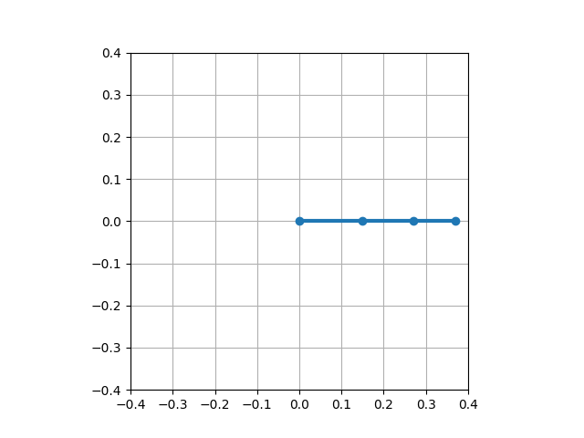
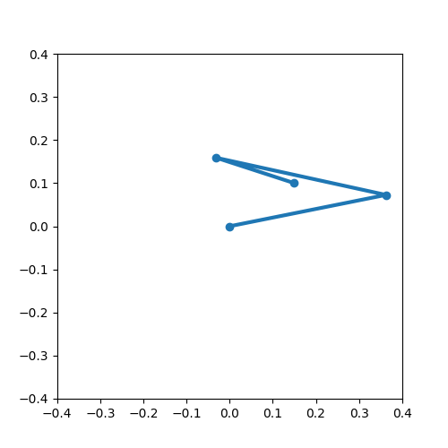

# 3-DOF Robotic Arm

An independent robotics project focused on building the software stack for a planar 3-DOF robotic manipulator. The project explores robot kinematics, trajectory planning, closed-loop control, and simulation as a foundation for future hardware deployment and learning-based manipulation.

---

## Features

* ✅ Forward kinematics
* ✅ Inverse kinematics
* ✅ Joint-space trajectory planning
* ✅ Cartesian trajectory planning
* ✅ PID joint controller
* ✅ Closed-loop Cartesian tracking
* ✅ Motion visualization and animation

---

## Project Structure

```text
3dof-robotic-arm/
├── config/              # Robot configuration files
├── control/             # Kinematics, controllers, trajectories
├── docs/                # Documentation and images
├── simulation/          # Simulation and visualization scripts
├── tests/               # Test scripts
└── README.md
```

---

## Motion Planning Pipeline

The current control pipeline is:

```text
Cartesian Target
        │
        ▼
Inverse Kinematics
        │
        ▼
Joint Trajectory
        │
        ▼
PID Controller
        │
        ▼
Robot Simulation
        │
        ▼
End-Effector Motion
```

---

## Current Results

### Robot Visualization


### Joint Motion Animation



### Cartesian Motion Demo



The simulator successfully generates smooth Cartesian trajectories, converts them to joint commands using inverse kinematics, and tracks the desired end-effector motion through closed-loop control.

---

## Implemented Components

### Kinematics

* Forward kinematics for a planar 3-link manipulator
* Analytical inverse kinematics solver
* End-effector position verification

### Motion Planning

* Joint-space interpolation
* Cartesian trajectory interpolation
* Continuous end-effector path generation

### Control

* PID joint controller
* Closed-loop tracking simulation
* Cartesian tracking validation

---

## Technologies

* Python
* NumPy
* Matplotlib
* Pillow (GIF generation)
* Git & GitHub

---

## Future Work

* Build the physical 3-DOF robotic arm
* Integrate embedded motor control
* Add a URDF robot model
* Simulate the robot in PyBullet or MuJoCo
* Implement dynamics-based control
* Add vision-guided manipulation
* Explore imitation learning and reinforcement learning for autonomous manipulation

---

## Author

**Adam Sabet**
